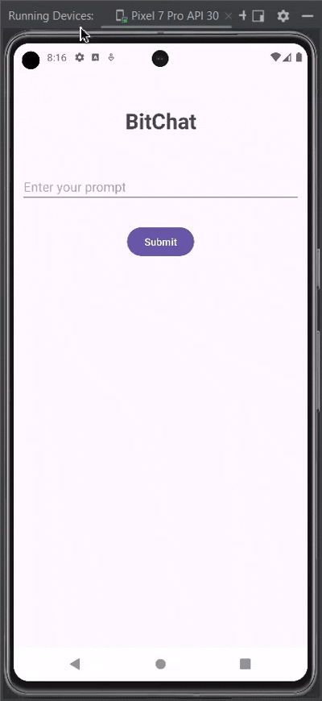

# BitChat

<p align="right">🌟 <a href="https://appetize.io/app/b_asoy3h3r3k4dgojrdqujetjkni" target="_blank">Try the Demo</a></p>


<a href="https://appetize.io/app/b_asoy3h3r3k4dgojrdqujetjkni">

</a>


🤖 **AI Chat Assistant App** 

An **Android application** built using **Kotlin** and **Jetpack Compose**, powered by the **Gemini API**, to provide a seamless chat experience where users can ask questions and receive intelligent responses.


 🚀 **Features**  

* 💬 **Chat Interface**: Ask questions and get instant, accurate answers.  
* 🎨 **Modern UI**: A clean, intuitive design developed with Jetpack Compose.  
* ⚡ **Real-Time Responses**: Fast and efficient replies, thanks to the Gemini API.  


 🛠️ **Tech Stack**  

* **Programming Language**: Kotlin  
* **UI Framework**: Jetpack Compose  
* **API Integration**: Gemini API  


 📥 **Getting Started**  

Follow these instructions to set up and run the project locally.  

### **Prerequisites**  
* 🛠️ Android Studio (latest version)  
* ☕ Java Development Kit (JDK)  

### **Installation**  
1. **Clone the Repository:**  
   ```bash  
   git clone https://github.com/DopeDev32/DopAi.git
   ```  
2. **Open the Project:**  
   Open the project in Android Studio.  

3. **Set Up API Key:**  
   Replace `YOUR_API_KEY` in the project with your Gemini API key.  


## 🏗️ **Build Instructions**  

1. Build the project using Gradle:  
   ```bash  
   ./gradlew assembleDebug  
   ```  


## 📱 **Running the App**  

1. Connect an **emulator** or a **physical device**.  
2. Run the app from Android Studio or use the command:  
   ```bash  
   ./gradlew installDebug  
   ```  


## 📋 **Usage**  

* Open the app.  
* Type your question in the chat box.  
* Receive intelligent responses powered by the Gemini API.  


<!--
## 📸 **Screenshots**  

[Include relevant screenshots or GIFs demonstrating the app’s features.]  
-->


## 🤝 **Contributing**  

Contributions are welcome!  

### **Steps to Contribute:**  
1. 🍴 Fork the repository.  
2. 🌿 Create a new branch for your feature or fix.  
3. 🔄 Commit your changes and push them.  
4. 📥 Open a pull request.  


## 📧 **Contact**  

 Feel free to reach out:  
✉️ **debashisgope01@gmail.com**  


